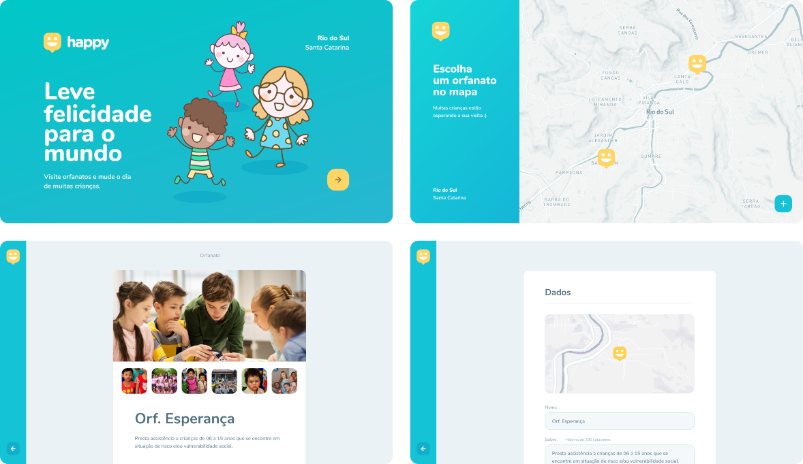

<h1 align="center">
    
</h1>

<h2 align="center">
    
</h2>

<h3 align="center"> 
	Status: finished :heavy_check_mark:
</h3>

<p align="center">


</p>

## 📋 Index

- [About](#-about)
- [Technologies](#-technologies)
- [How To Use](#-how-to-use)
- [Author](#-author)
- [License](#-license)

## ⏱ About

**Happy** is a web application developed during the Next Level Week by [Rocketseat](https://rocketseat.com.br/), and allows users to create and search orphanages around their cities in order to visit them and bring happiness to children who need it.

## 🤖 Technologies

The project front-end was developed using this technologies:

- [React.js](https://reactjs.org/)
- [React Router](https://reactrouter.com/)
- [TypeScript](https://www.typescriptlang.org/)
- [CSS3](https://developer.mozilla.org/pt-BR/docs/Web/CSS)
- [Leaflet](https://leafletjs.com/)
- [React Leaflet](https://react-leaflet.js.org/)
- [Axios](https://axios-http.com/docs/intro)

## ⚙ How to Use

```bash
# Clone this repository

$ git clone https://github.com/cassiocappellari/happy-web

# Enter the project folder

$ cd happy-web

# Install the dependencies

$ npm install

# Start the project

$ npm start

# Access the app

http://localhost:3000

```

## 👨‍🚀 Author

**Cássio Cappellari**

- GitHub: [@cassiocappellari](https://github.com/cassiocappellari)
- LinkedIn: [@cassiocappellari](https://www.linkedin.com/in/cassiocappellari/)

## 📝 License

This project is under the [MIT](./LICENSE) license.

---

Developed with 💙 by Cássio Cappellari!
